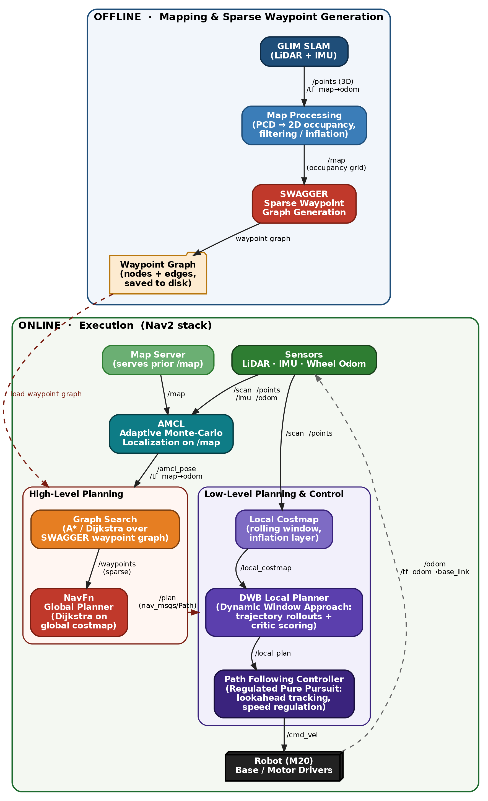

## Overview

This repository uses ROS2 to implement the entire Sim-to-sim workflow for autonomous navigation and locomotion with deeprobotics M20. This repo is built on top of DeepRobotics official [SDK](https://github.com/DeepRoboticsLab/sdk_deploy.git)

## High level architecture



## Hardware Requirements

**Tested Configuration:**
- GPU: NVIDIA RTX 5090 (Aftershock PC)
- System Memory: 64GB RAM
- VRAM: 25GB

**Observed Resource Usage (Multi-Robot Simulation):**
- VRAM: ~2.2GB
- GPU Utilization: ~16-20%
- Memory Utilization: ~5-6%

## Prerequisites

### ROS2 Humble
Install ROS2 Humble on Ubuntu 22.04:


### Install all dependency packages

```bash
sudo apt-get install ignition-fortress ros-humble-ros-gz-sim ros-humble-ros-gz-bridge ros-humble-ros-gz-interfaces ros-humble-navigation2 ros-humble-nav2-bringup ros-humble-nav2-amcl ros-humble-nav2-map-server ros-humble-nav2-lifecycle-manager ros-humble-robot-localization ros-humble-pointcloud-to-laserscan libevdev-dev python3-numpy
```

### Build

```bash
git clone --recursive https://github.com/AI-DA-STC/near-sdk-deploy-M20.git

# Compile
source /opt/ros/humble/setup.bash
cd near-sdk-deploy-M20
colcon build --cmake-args -DBUILD_PLATFORM=x86
```

### Setup SWAGGER 
- A python package that generates sparse waypoint graphs from occupancy grid maps for route planning.
- **No conda needed.** SWAGGER is installed into an isolated venv at `/root/swagger-venv` by
  [.devcontainer/post-create.sh](.devcontainer/post-create.sh) when the dev container is created. Activate it in
  any shell with the `swagger-env` alias (or `source /root/swagger-venv/bin/activate`).
- The venv is deliberate, not cosmetic: SWAGGER pins `numpy<2` and pulls CUDA wheels (`cucim-cu12`, `cupy-cuda12x`),
  which would break the system Python that ROS 2 uses.
- It is a **workstation-only, offline** tool — the robot/GOS deploy image ([Dockerfile.deploy](Dockerfile.deploy))
  installs only what the runtime needs to *read* a graph (`networkx`, `PyYAML`, `pyprojroot`). Generate maps and
  graphs on the workstation, then copy the artifacts to `~/maps` on the robot (mounted at `/root/ros_ws/maps`).
- To set it up outside the dev container, follow the upstream [README](src/src/SWAGGER/README.md) (needs CUDA 12.5+).

### Usage - SLAM using GLIM

```bash
# Terminal 1: Launch simulation with lidar
source install/setup.bash
ros2 launch rl_deploy gazebo_velodyne.launch.py
```

```bash
# Terminal 2: Launch GLIM for SLAM
ros2 launch rl_deploy glim_slam.launch.py
```
> - To save the map after loop closure, click on the top left "file" to save a .ply file.

<details>
<summary><strong>GLIM Config Changes</strong></summary>

Note : The following changes are made to GLIM SLAM config

**`config_ros.json`** — Update ROS2 topics:

| Parameter | Default (Ouster) | M20 Velodyne |
|---|---|---|
| `imu_topic` | `/os_cloud_node/imu` | `/M20/IMU` |
| `points_topic` | `/os_cloud_node/points` | `/M20/LIDAR/VELODYNE` |

**`config_sensors.json`** — Update IMU noise and LiDAR-IMU extrinsic:

| Parameter | Default (Ouster) | M20 Velodyne (Simulation) |
|---|---|---|
| `imu_acc_noise` | `0.05` | `0.001` |
| `imu_gyro_noise` | `0.02` | `0.001` |
| `imu_int_noise` | `0.001` | `0.0001` |
| `imu_bias_noise` | `1e-5` | `1e-7` |
| `T_lidar_imu` | `[0.006, -0.012, 0.008, 0, 0, 0, 1]` | `[-0.2368, -0.0268, -0.1885, 0, 0, 0, 1]` |

> **Note on IMU noise:** The Gazebo simulated IMU has `<noise type='none'/>` (perfect, zero noise) and `update_rate` set to `200` Hz (in `M20_velodyne.sdf`). Setting high noise values causes GLIM to under-trust IMU and drift. For **real hardware**, use the sensor's actual noise specs instead.

> **Note on T_lidar_imu:** This is in TUM format `[x, y, z, qx, qy, qz, qw]`. It transforms points from IMU frame to LiDAR frame. Calculated from:
> - IMU pose on M20: `(0.0632, -0.0268, -0.0435)`
> - Velodyne pose on M20: `(0.3, 0, 0.145)`
> - T_lidar_imu = Velodyne_pose - IMU_pose = `(-0.2368, -0.0268, -0.1885)`, identity rotation

</details>

```bash
# Terminal 3: Teleoperate robot with keyboard
ros2 run rl_deploy rl_deploy --ros-args -r __ns:=/M20
```
keyboard controls : 
> - **z**: default position
> - **c**: rl control default position
> - **wasd**: forward/leftward/backward/rightward
> - **q,e**: clockwise/counter clockwise

### Usage - autonomous waypoint navigation

```bash
#convert .ply to 2D occupancy costmap
python3 src/M20_sdk_deploy/scripts/ply_to_2d_map.py /path/to/map.ply -o /path/to/output_dir --z-min 0.1 --z-max 10

#z_min and z_max are min and max height for obstacle slice (in m)
```
> - the above script should generate a .pgm and a .yaml file

```bash
#generate a sparse waypoint graph using the 2d costmap (workstation dev container)
cd src/src/SWAGGER
swagger-env          # = source /root/swagger-venv/bin/activate
python3 scripts/generate_graph.py --map-path path/to/.pgm --resolution 0.05 --safety_distance 0.5 --output_dir /path/to/maps --occupancy_threshold 50
```
pls refer to the SWAGGER [README](src/src/SWAGGER/README.md) to understand more about the arguments usage

> **Leave `--x_offset`/`--y_offset` at 0.** SWAGGER already adds `image_height * resolution` to y internally
> ([waypoint_graph_generator.py:166](src/src/SWAGGER/swagger/waypoint_graph_generator.py#L166)), so its output sits in
> the map-image frame with ROS y-up and the bottom-left pixel at (0, 0). `route_server` then adds the `origin:` from
> the map `.yaml` to every node ([route_server.py:262-271](src/M20_sdk_deploy/scripts/route_server.py#L262-L271)).
> Passing the map origin to SWAGGER as well double-applies it and the graph lands one map-width away from the robot.

In separate terminals run the following : 
```bash
source /opt/ros/humble/setup.bash
source install/setup.bash
# Simulation 
ros2 launch rl_deploy gazebo_velodyne.launch.py
# launch navigation
ros2 launch rl_deploy navigation.launch.py
# RL controller in autonomous mode (instead of keyboard)
ros2 run rl_deploy rl_deploy --ros2-cmd -r __ns:=/M20
```

To set stand up state 
```bash
ros2 topic pub -1 /M20/target_mode std_msgs/msg/Int32 "{data: 1}"
```
To set RL control state
```bash
ros2 topic pub -1 /M20/target_mode std_msgs/msg/Int32 "{data: 6}"
```

Pause navigation
```bash
ros2 service call /linear_orchestrator/pause std_srvs/srv/Trigger
```

Stop navigation
```bash
ros2 service call /linear_orchestrator/stop std_srvs/srv/Trigger
```

Resume navigation
publish the {data:1} and {data:6} commands again

To take over control
```bash
ros2 run teleop_twist_keyboard teleop_twist_keyboard
```

#run rviz2 inside 104

sudo rm -rf /tmp/.docker.xauth && touch /tmp/.docker.xauth
xauth nlist $DISPLAY | sed -e 's/^..../ffff/' | xauth -f /tmp/.docker.xauth nmerge -
xauth -f /tmp/.docker.xauth list


docker run --rm -it --network host --ipc host   -e DISPLAY=$DISPLAY   -e XAUTHORITY=/tmp/.docker.xauth   -e QT_X11_NO_MITSHM=1   -e RMW_IMPLEMENTATION=rmw_cyclonedds_cpp   -e CYCLONEDDS_URI=file:///root/ros_ws/config/cyclonedds_gos.xml   -v /tmp/.docker.xauth:/tmp/.docker.xauth:ro   -v $PWD/config/cyclonedds_gos.xml:/root/ros_ws/config/cyclonedds_gos.xml:ro   -v $PWD/custom_nav2.rviz:/root/ros_ws/custom_nav2.rviz:ro   m20-deploy:humble rviz2 -d /root/ros_ws/custom_nav2.rviz

#to manually change nav params on container in robot during finetuning 
```bash
# 1. out
docker cp nav_core:/root/ros_ws/install/rl_deploy/share/rl_deploy/config/nav2/navigation_params.yaml \
  ./navigation_params.yaml

# 2. edit ./navigation_params.yaml

# 3. back in
docker cp ./navigation_params.yaml \
  nav_core:/root/ros_ws/install/rl_deploy/share/rl_deploy/config/nav2/navigation_params.yaml

# 4. reload — restart, do NOT recreate
docker compose restart nav_core

# 5. measure
docker exec nav_core bash -c 'source /root/ros_ws/install/setup.bash && ros2 topic hz /cmd_vel'
```