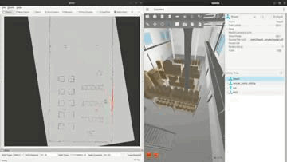
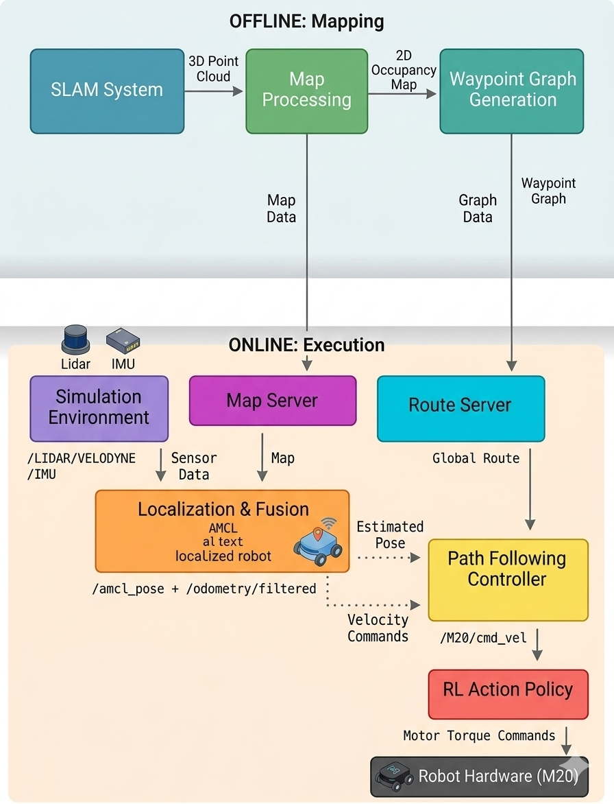

## Overview

This repository uses ROS2 to implement the entire Sim-to-sim workflow for autonomous navigation and locomotion with deeprobotics M20. This repo is built on top of DeepRobotics official [SDK](https://github.com/DeepRoboticsLab/sdk_deploy.git)


Autonomous waypoint navigation using LiDAR-intertial SLAM with SWAGGER + Nav2 Router

## High level architecture



## Hardware Requirements

**Tested Configuration:**
- GPU: NVIDIA RTX 5090 (Aftershock PC)
- System Memory: 64GB RAM
- VRAM: 25GB

**Observed Resource Usage (Multi-Robot Simulation):**
- VRAM: ~2.2GB
- GPU Utilization: ~16-20%
- Memory Utilization: ~5-6%

## Prerequisites

### ROS2 Humble
Install ROS2 Humble on Ubuntu 22.04:


### Install all dependency packages

```bash
sudo apt-get install ignition-fortress ros-humble-ros-gz-sim ros-humble-ros-gz-bridge ros-humble-ros-gz-interfaces ros-humble-navigation2 ros-humble-nav2-bringup ros-humble-nav2-amcl ros-humble-nav2-map-server ros-humble-nav2-lifecycle-manager ros-humble-robot-localization ros-humble-pointcloud-to-laserscan libevdev-dev python3-numpy
```

### Build

```bash
git clone --recursive https://github.com/AI-DA-STC/near-sdk-deploy-M20.git

# Compile
source /opt/ros/humble/setup.bash
cd near-sdk-deploy-M20
colcon build --cmake-args -DBUILD_PLATFORM=x86
```

### Setup SWAGGER 
- A python package that generates sparse waypoint graphs from occupancy grid maps for route planning.
- Follow the [README](src/SWAGGER/README.md) to setup a separate conda env and install dependencies

### Usage - SLAM using GLIM

```bash
# Terminal 1: Launch simulation with lidar
source install/setup.bash
ros2 launch rl_deploy gazebo_velodyne.launch.py
```

```bash
# Terminal 2: Launch GLIM for SLAM
ros2 launch rl_deploy glim_slam.launch.py
```
> - To save the map after loop closure, click on the top left "file" to save a .ply file.

<details>
<summary><strong>GLIM Config Changes</strong></summary>

Note : The following changes are made to GLIM SLAM config

**`config_ros.json`** — Update ROS2 topics:

| Parameter | Default (Ouster) | M20 Velodyne |
|---|---|---|
| `imu_topic` | `/os_cloud_node/imu` | `/M20/IMU` |
| `points_topic` | `/os_cloud_node/points` | `/M20/LIDAR/VELODYNE` |

**`config_sensors.json`** — Update IMU noise and LiDAR-IMU extrinsic:

| Parameter | Default (Ouster) | M20 Velodyne (Simulation) |
|---|---|---|
| `imu_acc_noise` | `0.05` | `0.001` |
| `imu_gyro_noise` | `0.02` | `0.001` |
| `imu_int_noise` | `0.001` | `0.0001` |
| `imu_bias_noise` | `1e-5` | `1e-7` |
| `T_lidar_imu` | `[0.006, -0.012, 0.008, 0, 0, 0, 1]` | `[-0.2368, -0.0268, -0.1885, 0, 0, 0, 1]` |

> **Note on IMU noise:** The Gazebo simulated IMU has `<noise type='none'/>` (perfect, zero noise) and `update_rate` set to `200` Hz (in `M20_velodyne.sdf`). Setting high noise values causes GLIM to under-trust IMU and drift. For **real hardware**, use the sensor's actual noise specs instead.

> **Note on T_lidar_imu:** This is in TUM format `[x, y, z, qx, qy, qz, qw]`. It transforms points from IMU frame to LiDAR frame. Calculated from:
> - IMU pose on M20: `(0.0632, -0.0268, -0.0435)`
> - Velodyne pose on M20: `(0.3, 0, 0.145)`
> - T_lidar_imu = Velodyne_pose - IMU_pose = `(-0.2368, -0.0268, -0.1885)`, identity rotation

</details>

```bash
# Terminal 3: Teleoperate robot with keyboard
ros2 run rl_deploy rl_deploy --ros-args -r __ns:=/M20
```
keyboard controls : 
> - **z**: default position
> - **c**: rl control default position
> - **wasd**: forward/leftward/backward/rightward
> - **q,e**: clockwise/counter clockwise

### Usage - autonomous waypoint navigation

```bash
#convert .ply to 2D occupancy costmap
python src/M20_sdk_deploy/scripts/ply_to_2d_map.py ply /path/to/.ply -o /path/to/output_dir --z-min 0.1 --z-max 10

#z_min and z_max are min and max height for obstacle slice (in m)
```
> - the above script should generate a .pgm and a .yaml file

```bash
#generate a sparse waypoint graph using the 2d costmap
cd src/SWAGGER
conda activate swagger
python3 scripts/generate_graph.py --map-path path/to/.pgm --resolution 0.05 --x_offset -15.3753 --y_offset -28.6156 --safety_distance 0.5 --output_dir /path/to/maps --occupancy_threshold 50
```
pls refer to the SWAGGER [README](src/SWAGGER/README.md) to understand more about the arguments usage

In separate terminals run the following : 
```bash
# Simulation 
ros2 launch rl_deploy gazebo_velodyne.launch.py
# localization 
ros2 launch rl_deploy amcl_localization.launch.py
# route server 
ros2 launch rl_deploy route_server.launch.py
#path follower controller
ros2 launch rl_deploy path_follower.launch.py
# RL deploy in autonomous mode (instead of keyboard)
ros2 run rl_deploy rl_deploy --ros2-cmd
```

Visualization in Rviz: set "2D Pose Estimate" → then "2D Goal Pose"
Robot will follow the SWAGGER graph path automatically

> - Safety: if no /M20/cmd_vel is received for >0.5 s (e.g., path follower crashes), the C++ interface zeros all velocity commands — the robot stops safely.


